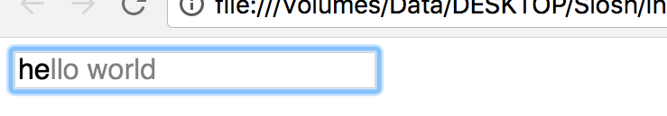

# Slosh

Slosh is a set of advanced Javascript-based UI elements. This project is still under development.

### Current Elements:
	- UIInputBox (input box with hint)
	 

### Currently WIP:
	- UITextbox (like input box but multi-line)
	- UIImage (progressive blur-in image)
	- Documentation


## Usage

To use the elements, simply use their tag name. For example

```html
	<ui-inputbox value="Hello world"></ui-inputbox>
```

or programmatically:
```typescript
	let inputbox = document.createElement('ui-inputbox');
```
